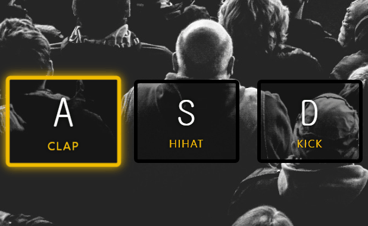
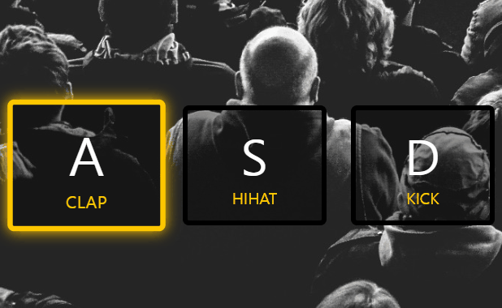

## Notes

### keycode -> keydown
이벤트 `keycode`는 더 이상 쓰지않는다고 나와있어서 `keydown`으로 변경했다.

`window.addEventListener("keydown", playSound);
`

### transitionend 이벤트
- CSS 전환이 완료되면 시작하는 이벤트
- 트랜지션된 css의 개수만큼 이벤트가 일어나는 것 같다.
- 밑 버그 문제 때문에 사용하지는 않았다.


### <kdb>
The Keyboard Input element


### dataset
- HTML 요소에 정의한 사용자 정의 어트리뷰트와 JS 간에 데이터를 교환할 수 있게 한다.
- data 어트리뷰트는 data-user-id, data-role과 같이 data- 접두사 다음에 임의의 이름을 붙여 사용하고 HTMLElement.dataset 프로퍼티로 취득할 수 있다.
- HTMLElement 인터페이스의 읽기 전용 속성인 dataset은 element에 대한 사용자 정의 어트리뷰트에 대한 읽기/쓰기 액세스를 제공한다.
- dataset 프로퍼티는 HTML 요소의 모든 data 어트리뷰트의 정보를 제공하는 DOMStringMap 객체를 반환한다.

```js
const key = document.querySelector(`div[data-key=${keyName}]`)
const audio = document.querySelector(`audio[data-key=${keyName}]`)
```

> 출처 : 모던자바스크립트 Deep Dive by 이웅모


### 버그 해결
- 연속된 버튼을 입력 또는 클릭하면 화면에 `.playing` css가 멈춰있는 버그 발생  

  

- `transitionend` 이벤트로 클릭 css를 없애면 버튼을 빠르게 클릭했을 때 `.playing` class가 사라지지 않는다. 이벤트가 빠르게 쌓이면서 transition 되는 걸 감지를 못하는 것 같다. css class가 없어지지 않아서 멈춰보이는 것 보다 setTimeout을 사용하는 게 더 나은 것 같아 `setTimeout`을 사용했다.



Original Solution
```js
function removeTransition(e) {
	if (e.propertyName !== 'transform') return;
	e.target.classList.remove('playing');
}

const keys = Array.from(document.querySelectorAll('.key'));
keys.forEach(key => key.addEventListener('transitionend', removeTransition));
```

- `document.querySelectorAll('.key')`의 NodeList를 배열로 바꾸기 위해서 Array.from을 쓴 것 같다. (튜토리얼 영상에는 나오지 않아 유추해보았다.)
- Array.from 말고도 spread 연산자를 사용할 수 있다.


My Solution
```js
setTimeout(() => {
	key.classList.remove("playing");
}, 100);
```
